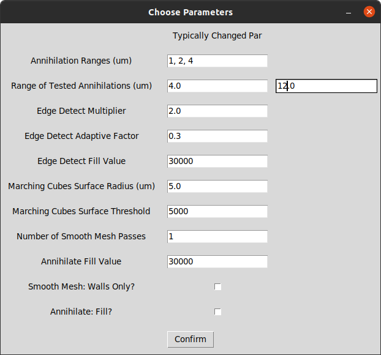

# Automated_MorphoGraphX_PaCeQuant

# Purpose

This python script automates the extraction of signal in regards to the surface using MorphoGraphX with the goal of cell segmentaion of (fresh) plant pavement cells. The automation is based on a workflow described in https://doi.org/10.1186/s12915-019-0657-1 (Erguvan et al. 2019).
 

Specifically, the worklfow automates MorphoGraphX, used to extract only the signal in a certain distance to the cell surface and creates tif files, which can then be used by PaCeQuant, a tool for pavement cell segmentation.
The script generates many such tif files based on the user's input parameters as descibed below. Among these you can then choose the best segmentation. 
 

If you wish to auotmate MorphoGraphX with a similar, or even different purpose, I hope this script can still be of use to realize your own script.

# Introduction

Pavement cells of the plant leaf epidermis are shaped in a complex manner. Quantifying such
complex cells is not trivial, especially not if you want to avoid manual segmentation.
PaCeQuant (Möller et al. 2017), a watershed-based segmentation tool specifically designed for pavement cells, can be used to segment these cells. However, as the cells, as well as the tissue itself, is curved, a single image or a simple MAX-z-projection don't produce satisfying results, especially when you want to look at many cells. With MorphoGraphX (Strauss et al. 2021), a software to analyze bend tissue and cells, only the signal with a certain distance to the surface can be extracted (aka annihilated).

# Requirements

 <strong>MorphoGraphX 2.0.1</strong> (https://morphographx.org/software/). Tested specifically on the cuda version on Ubuntu 20.04 (mgx-2.0.1-382-ubuntu20.04-cuda). Other versions of 2.0.1 (e.g. without cuda) should also work, but those besides 2.0.1 may have different names or parameter structures for the processes used.
 

 <strong>Python 3 as well as Python 2.7</strong>. You should run the script using the latest Python version (tested on 3.8). Python 2.7 is required for running python within MorphoGraphX. If in MorphoGraphX under Processes/Misc you do not see a Python tab, you have probably not installed Python 2.7. 

This script does not require a local running Fiji version with PaCeQuant. Rather, it makes use of <strong>PyImageJ</strong>, a python library to run ImageJ (https://py.imagej.net/en/latest/index.html). However, if you wish to use PaCeQuant to segment your cells (any maybe even manually correct the PaCeQuant segmentations), you require MiToBo (not part of the script). MiToBo can be installed as a Fiji extension or standalone. More information here: https://mitobo.informatik.uni-halle.de/index.php/Main_Page. 

Besides PyImageJ, you also need the following Python libraries: <strong>subprocess</strong>, <strong>os</strong>, <strong>tkinter</strong>, <strong>sys</strong>, <strong>numpy</strong>, <strong>json</strong>, <strong>time</strong>, <strong>shutil</strong> and <strong>re</strong>.

# Worklfow 
### Upon Start-Up

When executing the script you will be prompted to select a folder containing your tif files of interest. Afterwards, you need to provide the Gaussian filter radius (in um) as well as the Edge Detect Threshold, used by MorphoGraphX, for each tif file. These values provide the basis of the surface created in MorphoGraphX.

The next window asks you to change the general parameters. You probably won't change most of these, but you probably want to change the Annhiliation Ranges and Range of Tested Annihilations according to your files. More information on this below.

A .py script is created containing all parameters set, and MorphoGraphX is started. As the last manual step, in MorphoGraphX select the python file that was just created in the prior chosen directory using Processes/Misc/Python

### MorphoGraphX: Creates tif files of signal only in a certain distance to the surface

For each tif file the stack is loaded (<strong>Processes/Stack/System/Open</strong>). If you have ticked the box to flip the stack for a specific tif file, the stack will be flipped (<strong>Process/Stack/Canvas/ReverseAxes</strong> with z: yes) Afterwards, the given Gaussian Filter is applied (<strong>Process/Stack/Filters/GaussianBlurStack</strong>) and edge detect is run with the chosen threshold (<strong>Process/Stack/Morphology/EdgeDetect</strong>). Using this, a mesh (aka surface) is created using <strong>Process/Mesh/Creation/MarchingCubesSurface</strong>, smoothed (<strong>Process/Mesh/Structure/SmoothMesh</strong>) and subdivided (<strong>Process/Mesh/Structure/Subdivide</strong>). The main stack (not Gaussed) is then loaded (<strong>Process/Stack/MultiStack/CopyMainToWork</strong>) and the signal with a certain distance to the surface is picked (aka annihilated) using <strong>Process/Stack/MeshInteraction/Annihilate</strong>. Finally, the working stack is copied to the main stack (<strong>Process/Stack/MultiStack/CopyWorkToMain</strong>) and the tif is saved (<strong>Process/Stack/System/Save</strong>).

Note that for each tif input file this workflow is/can be applied with different annihilation parameters. Specifically, the thickness of signal used (dubbed Annihilation Ranges (um), e.g. 2 for a thickness of 2 um) and which range should be tested (dubbed Range of Tested Annihilations (um), e.g. Min: 8.0 and Max: 14.0 -> This would, given an Annihilation Range of 2 um, run the workflow for the following annihilations: 8-10 um, 10-12 um and 12-14 um). Note that you can choose multiple Annihilation Ranges (e.g. 2, 4) to get all tif files in the given Range of Tested Annihilations with thickness of 2 um AND 4 um. Again, if you wish to add another parameter to test for in this workflow, implementation should be rather simple. 

### Fiji: used to get rid of some artifacts created when using MorphoGraphX, as well as perform the MAX-z-projection

Once the tif file(s) for each tif input file are aquired Fiji is used (in the form of PyImageJ) to get MAX-z-projections. Before that, however, some artifacts produced by the annihlation function of MorphoGraphX are fixed. The anihilation function does not only "annihilate" form the direction of the upper surface, but from  all around the produced surface. Thus, a bottom layer as well as a border around the whole stack would be MAX-projected. To remove these, a simple cropping (to get rid of the borders, i.e. the projection form the sides) and a duplication of the stack cutting off the bottom based on the annihilation and voxel sizes are performed. Finally, the MAX-z-projection is performed. This ought to work unrelated to the input image as long it is a tif file containing the voxel sizes.

### After the Script: PaCeQuant (Fiji): Segments the cells

PaCeQuant can finally be applied on the whole directory (After_MorphoGraphX) containing all output files. Here, the standard settings are used, and no IDs are generated in the resulting image. IDs are not included as they create artifacts when manually correcting the segmentation afterwards. Thus, if you want to have any IDs you can run PaCeQuant manually using the segmentations as input files and check the box to inlcude IDs. This will also re-create the feature files (which is relevant if you manually corrected the segmentation; otherwise they are the same of course).

However, you could use other segmentation tools, like LeafNet (which can be used with the same workflow).

# Supplementary Information
### Example Images

We provide two examples for this workflow. Both are Col-0 ecotype cotyledons of 7 day old seedlings captured life, stained with propidium iodide (2/3 mg/mL, 20 min, 2x 1 min destilled water wash), captured using confocal microscopy (Leica SP8 reversed, 20x dry NA 0.75). A Gaussian radius of 1 um and an edge detect threshold of 2500 was chosen for both. The general parameters are displayed in the tkinter screenshot below. We provide not only the .tif files, but also the end results of the workflow (the MAX-z-projections), and the subsequent PaCeQuant results. 

### Prior Work

We provide a pdf (ProjectModule_PriorWork.pdf) describing work performed on imaging methods, stains, fixations, and more.

# Sources

<strong>Worfklow:</strong> Erguvan, Özer et al. (May 2019). “ImageJ SurfCut: a user-friendly pipeline for high-throughput
extraction of cell contours from 3D image stacks”. In: BMC Biology 17.1. issn: 1741-7007.
doi: 10.1186/s12915-019-0657-1. url: http://dx.doi.org/10.1186/s12915-019-0657-1

<strong>MorphoGraphX</strong>: Strauss, Soeren et al. (2021). “MorphoGraphX 2.0: Providing context for biological image analysis
with positional information”. In: bioRxiv. doi: 10.1101/2021.08.12.456042. eprint: https:
//www.biorxiv.org/content/early/2021/08/13/2021.08.12.456042.full.pdf. url: https:
//www.biorxiv.org/content/early/2021/08/13/2021.08.12.456042.

<strong>PaCeQuant</strong>: Möller, Birgit et al. (Sept. 2017). “PaCeQuant: A Tool for High-Throughput Quantification of
Pavement Cell Shape Characteristics”. In: Plant Physiology 175.3, pp. 998–1017. issn: 0032-
0889. doi: 10.1104/pp.17.00961. eprint: https://academic.oup.com/plphys/article-pdf/175/
3/998/37245904/plphys\_v175\_3\_998.pdf. url: https://doi.org/10.1104/pp.17.00961.

<strong>Fiji</strong>: Schindelin, Johannes et al. (June 2012). “Fiji: an open-source platform for biological-image anal-
ysis”. In: Nature Methods 9.7, pp. 676–682. issn: 1548-7105. doi: 10.1038/nmeth.2019. url:
http://dx.doi.org/10.1038/nmeth.2019

